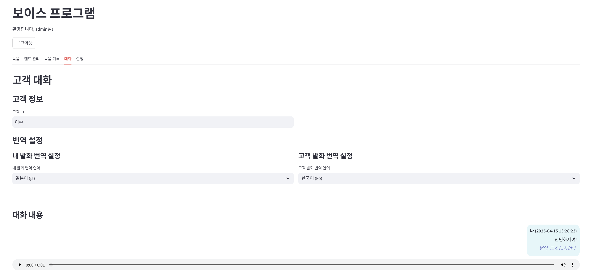

# 🎙️ 보이스 프로그램

피부과 상담사를 위한 다국어 음성 녹음 및 번역 프로그램입니다.

## 프로그램 소개

이 프로그램은 피부과 상담사를 위한 다국어 음성 녹음 및 번역 프로그램입니다. 사용자 인증, 고품질 음성 녹음, 다국어 번역, 멘트 관리, 고객별 녹음 관리 등 다양한 기능을 제공합니다.

## 주요 기능

- 🔐 사용자 인증 기능
- 🎤 고품질 음성 녹음 (마이크 선택 가능)
- 🌐 다국어 번역 (한국어, 영어, 일본어, 중국어)
- 📝 자주 사용하는 멘트 관리 및 검색
- 🔍 멘트 검색 기능
- 📂 고객별/날짜별 녹음 파일 관리
- 📁 오디오 파일 업로드 및 관리
- 📅 녹음 기록 확인
- 🤖 OpenAI API를 이용한 STT 및 번역 기능
- 💬 채팅 인터페이스로 대화 기록

## 설치 방법

### 1. 개발자용 설치 (소스코드 실행)

개발 목적이나 코드 수정이 필요한 경우 이 방법을 사용하세요:

1. **Python 설치**: Python 3.8 이상 버전 필요
2. **코드 다운로드**:
   ```
   git clone https://github.com/yourusername/VoiceProgram.git
   cd VoiceProgram
   ```
3. **필요 패키지 설치**:
   ```
   pip install -r requirements.txt
   ```
4. **실행 방법**:
   ```
   streamlit run streamlit_app.py
   ```

개발 모드로 실행하면 로그인 화면에서 "개발 모드" 체크박스를 선택하여 인증 절차 없이 접속할 수 있습니다.

### 2. 일반 사용자용 설치 (EXE 파일)

기술적 지식 없이 쉽게 사용하려면 이 방법을 사용하세요:

1. 제공된 `VoiceProgram.exe` 파일 다운로드
2. 다운로드한 파일을 더블클릭하여 실행
3. 처음 실행 시 Windows 보안 경고가 표시될 수 있으나 "추가 정보" → "실행" 버튼을 클릭하여 진행

## EXE 파일 빌드 방법 (개발자용)

직접 EXE 파일을 빌드하려면:

1. **PyInstaller 설치**:
   ```
   pip install pyinstaller
   ```
2. **빌드 스크립트 실행**:
   ```
   python build_exe.py
   ```
3. 빌드가 완료되면 `dist` 폴더에 `VoiceProgram.exe` 파일이 생성됩니다.
4. 이 파일을 일반 사용자에게 배포할 수 있습니다.

## 프로그램 사용 방법

1. 프로그램 실행 후 로그인 화면에서 계정 정보 입력

   - 기본 계정: admin / password
2. 메인 화면의 탭을 통해 다양한 기능 사용:

   - **녹음 탭**: 멘트 선택 후 고객 ID 입력하여 녹음
   - **멘트 관리 탭**: 자주 사용하는 멘트를 그룹별로 관리
   - **녹음 기록 탭**: 날짜별/고객별 녹음 내역 확인
   - **대화 탭**: 고객과의 음성 대화 녹음 및 번역
   - **설정 탭**: API 키 설정 및 기본 환경 구성

## 주의사항 및 팁

1. **API 키 설정**: OpenAI API 기능을 사용하려면 설정 탭에서 API 키를 등록해야 합니다.
2. **마이크 접근**: 프로그램 실행 시 마이크 접근 권한을 허용해야 녹음 기능이 작동합니다.
3. **녹음 저장**: 모든 녹음은 자동으로 날짜와 고객 ID 기준으로 폴더에 정리됩니다.
4. **인터넷 연결**: STT 및 번역 기능은 인터넷 연결이 필요합니다.
5. **개인정보 보호**: 고객 녹음 시 동의를 받고, 개인정보 보호에 유의하세요.
6. **음성 녹음에는 고객의 동의가 필요합니다.**
7. **개인정보 보호를 위해 녹음 파일은 암호화하여 저장하는 것이 좋습니다.**

## 보안 고려사항

프로젝트를 GitHub에 업로드하기 전에 다음 보안 조치를 반드시 취하세요:

1. **민감한 설정 파일의 처리**:
   - `.env` 파일을 `.env.example`로 변환하고 실제 API 키는 제거하세요
   - `config.yaml` 파일을 `config.yaml.example`로 변환하고 실제 계정 정보는 더미 데이터로 교체하세요
   - 민감한 정보가 포함된 원본 파일들은 `.gitignore`에 추가하세요

2. **프로젝트 공개 전 확인사항**:
   - 모든 API 키와 비밀번호가 제거되었는지 확인
   - 실제 사용자 계정 정보가 노출되지 않았는지 확인
   - 데이터베이스 접속 정보가 안전하게 처리되었는지 확인

3. **사용자 인증정보 보호**:
   - 실제 배포 시에는 반드시 안전한 비밀번호 정책을 적용하세요
   - 평문 비밀번호 대신 해시된 비밀번호를 사용하세요

## 배포 방법

### 데스크톱 앱 배포

- `dist/VoiceProgram.exe` 파일을 사용자에게 배포합니다.
- 관리자 권한으로 실행해야 합니다.
- 필수 파일: EXE 배포 시 config.yaml 파일이 함께 포함되어야 합니다.
- 권한 설정: 일부 기능은 관리자 권한이 필요할 수 있습니다.
- 시스템 요구사항: Windows OS에서 최적화되어 있습니다.
- 방화벽 설정: 프로그램이 인터넷에 접속할 수 있도록 방화벽 예외 설정이 필요할 수 있습니다.

# 화면



## 라이센스

이 프로젝트는 APACHE 2.0 라이센스를 따릅니다.
